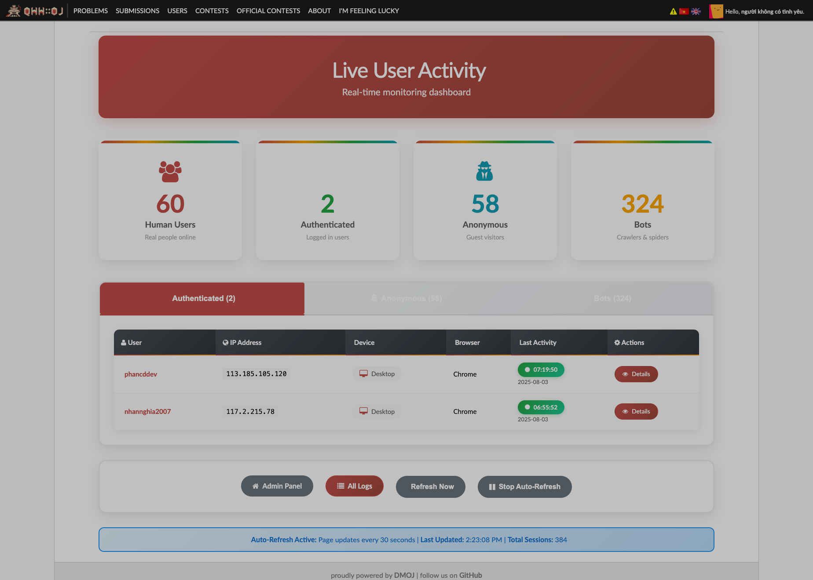

# 🚀 Quick Start Guide

## Screenshots

### Active Users Dashboard


### User Activity Detail


## Installation (Automatic)

1. **Download the module**:
   ```bash
   git clone https://github.com/phancddev/dmoj-user-activity-tracker.git
   cd dmoj-user-activity-tracker
   ```

2. **Run the automatic installer**:
   ```bash
   python installation/install.py /path/to/your/dmoj/project
   ```

3. **Install dependencies**:
   ```bash
   pip install -r requirements.txt
   ```

4. **Run migrations**:
   ```bash
   cd /path/to/your/dmoj/project
   python manage.py makemigrations user_activity
   python manage.py migrate
   ```

5. **Restart your Django application**

## Installation (Manual)

If the automatic installer doesn't work, follow these steps:

1. **Copy files**:
   ```bash
   cp -r user_activity /path/to/your/dmoj/project/
   cp -r templates/* /path/to/your/dmoj/templates/
   ```

2. **Update settings.py**:
   ```python
   INSTALLED_APPS = [
       # ... existing apps ...
       'user_activity',
   ]
   
   MIDDLEWARE = [
       # ... existing middleware ...
       'user_activity.middleware.UserActivityMiddleware',
   ]
   ```

3. **Update urls.py**:
   ```python
   urlpatterns = [
       # ... existing patterns ...
       path('admin/user-activity/', include('user_activity.urls')),
   ]
   ```

4. **Run migrations** (same as automatic)

## Access the Dashboard

- **Active Users**: `http://yoursite.com/admin/user-activity/active-users/`
- **All Logs**: `http://yoursite.com/admin/user-activity/all-logs/`
- **User Detail**: `http://yoursite.com/admin/user-activity/user/{username}/`

## Features Available

✅ Real-time user tracking  
✅ Session management  
✅ Device detection  
✅ IP address monitoring  
✅ Activity analytics  
✅ Admin interface  
✅ Anonymous user tracking  

## Support

- Read the full README.md for detailed documentation
- Check the installation script output for any issues
- Ensure all dependencies are installed correctly
- Contact the author: [@phancddev](https://github.com/phancddev)

---

🎉 **Congratulations!** Your DMOJ now has comprehensive user activity tracking!

Developed by [Phan Cong Dung](https://github.com/phancddev) 